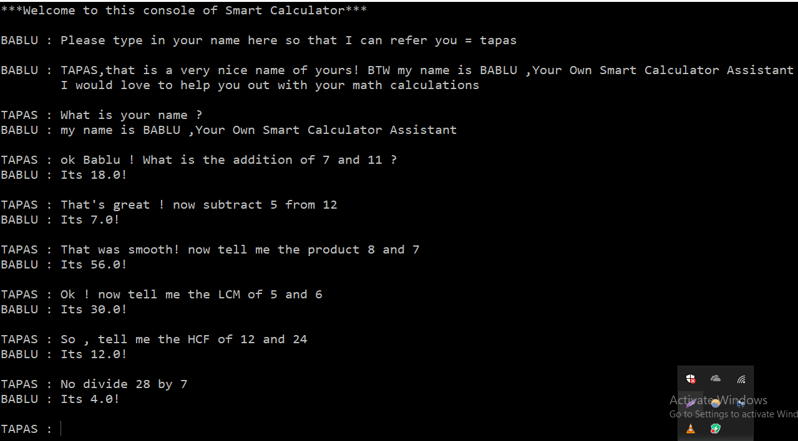

# BABLU-The-Smart-Calculator-Assistant
I've coded this Smart Calculator Assistant, named it BABLU :P which would help you out in your basic match problems like addition,subtarction,divison,multipliaction,HCM,LCM etc just like a chatbot by conversing with him through chatting.
And I didn't use any fancy or sophisticated libraries, I've just used basic Python to make this happen.

<h3>To give you more clear overview I've attached screeshots of my project below</h3>
  

